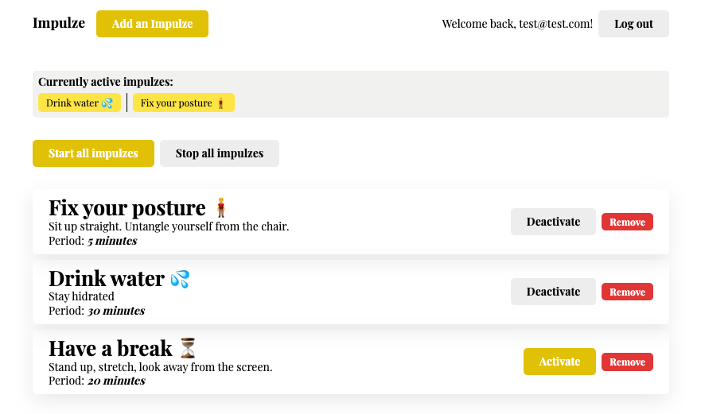
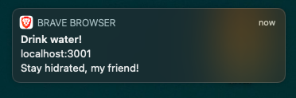

# ⚡️ Impulze Client

Front-end client for the Impulze reminder application.



The application uses native browser notifications to notify you about you reminders.



## Project description

This template should help get you started developing with Vue 3 and Typescript in Vite. The template uses Vue 3 `<script setup>` SFCs, check out the [script setup docs](https://v3.vuejs.org/api/sfc-script-setup.html#sfc-script-setup) to learn more.

## Environment setup

First, you'll have to install packages by running:

```bash
npm install
```

For local development, you will need to connect to an instance of the API, found in the old (legacy) impulze project. There, the script is labeled as `server`. Then, you need to set the .env variable like this:

```bash
VUE_APP_API_URL=http://localhost:3000
```

An example is already present in the repository.

To run the project for local development, run:

```bash
npm run dev
```

You can also use yarn if you so prefer.

To build the project for production, run:

```bash
npm run build
```

For running the tests, run:

```bash
npm run test
```

or do the same, but in watch mode:

```bash
npm run test:watch
```

To run the linter, run

```bash
npm run lint
```

or to fix the code:

```bash
npm run lint:fix
```

## Recommended IDE Setup

- [VSCode](https://code.visualstudio.com/) + [Volar](https://marketplace.visualstudio.com/items?itemName=johnsoncodehk.volar)

## Type Support For `.vue` Imports in TS

Since TypeScript cannot handle type information for `.vue` imports, they are shimmed to be a generic Vue component type by default. In most cases this is fine if you don't really care about component prop types outside of templates. However, if you wish to get actual prop types in `.vue` imports (for example to get props validation when using manual `h(...)` calls), you can enable Volar's `.vue` type support plugin by running `Volar: Switch TS Plugin on/off` from VSCode command palette.
